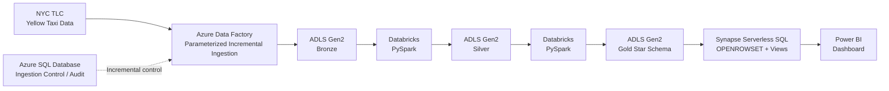

# 🚕 NYC Taxi Data Engineering End-to-End Project — Azure

## Objective

In this project, I designed and implemented an end-to-end data engineering pipeline using **Microsoft Azure** to process monthly NYC Yellow Taxi trip data.

The pipeline consists of several stages:

1. Extracted monthly NYC Yellow Taxi trip data and ingested it into **Azure Data Lake Storage Gen2** using **Azure Data Factory**.
2. Implemented parameterized and incremental ingestion using **Azure SQL Database** as a control and audit table.
3. Cleaned and transformed the data using **Databricks and PySpark**, storing the processed data in the Silver layer.
4. Built a **Gold star schema** consisting of fact and dimension tables using PySpark.
5. Stored the Gold datasets as Parquet files in ADLS Gen2.
6. Used **Azure Synapse Serverless SQL** to query the Gold Parquet files directly and expose SQL views.
7. Connected the curated data to **Power BI** for reporting and analysis.

As this is a data engineering project, my emphasis is primarily on the **data pipeline, cloud architecture, transformation, orchestration, and data modeling**, with less emphasis on dashboard development.

The sections below explain the technologies, architecture, data model, and individual pipeline stages.

---

## Table of Contents

- [Dataset Used](#dataset-used)
- [Technologies](#technologies)
- [Data Pipeline Architecture](#data-pipeline-architecture)
- [Data Modeling](#data-modeling)
- [Step 1: Incremental Data Ingestion](#step-1-incremental-data-ingestion)
- [Step 2: Data Transformation](#step-2-data-transformation)
- [Step 3: Gold Data Modeling](#step-3-gold-data-modeling)
- [Step 4: Data Serving](#step-4-data-serving)
- [Step 5: Analytics](#step-5-analytics)
- [Data Validation](#data-validation)
- [Project Structure](#project-structure)

---

## Dataset Used

This project uses the **NYC Taxi & Limousine Commission (TLC) Yellow Taxi Trip Record Data**.

The dataset contains information including:

- Pickup and drop-off timestamps
- Pickup and drop-off taxi zones
- Trip distance
- Passenger count
- Rate code
- Payment type
- Fare amount
- Tip amount
- Tolls
- Additional charges
- Total trip amount

NYC TLC publishes the trip data monthly in **Parquet format**, making it suitable for processing with Spark and other analytical technologies.

### Data Source

- [NYC TLC Trip Record Data](https://www.nyc.gov/site/tlc/about/tlc-trip-record-data.page)
- [Yellow Taxi Data Dictionary](https://www.nyc.gov/assets/tlc/downloads/pdf/data_dictionary_trip_records_yellow.pdf)

For this project, I used the **2026 Yellow Taxi monthly data**.

---

## Technologies

The following technologies were used to build the project:

| Area | Technology |
|---|---|
| Cloud Platform | Microsoft Azure |
| Language | Python, SQL |
| Orchestration | Azure Data Factory |
| Data Lake | Azure Data Lake Storage Gen2 |
| Data Processing | Databricks |
| Transformation | PySpark |
| Control / Audit | Azure SQL Database |
| Data Serving | Azure Synapse Serverless SQL |
| Storage Format | Parquet |
| Visualization | Power BI |

---

## Data Pipeline Architecture

Data Flow Overview 


The pipeline follows a **medallion architecture**, with ADLS Gen2 acting as the central data lake.



### Pipeline Flow

```text
NYC TLC
   │
   ▼
Azure Data Factory
   │
   ├──────────────► Azure SQL
   │                Control / Audit
   │
   ▼
ADLS Gen2 - Bronze
   │
   ▼
Databricks / PySpark
   │
   ▼
ADLS Gen2 - Silver
   │
   ▼
Databricks / PySpark
   │
   ▼
ADLS Gen2 - Gold
   │
   ▼
Synapse Serverless SQL
   │
   ▼
Power BI
```

---

## Data Modeling

The Gold layer follows a **star schema** design.

The central fact table contains trip-level information, while dimension tables provide reusable descriptive attributes.

```text
                       fact_taxi_trips
                              │
             ┌────────────────┼────────────────┐
             │                │                │
             ▼                ▼                ▼
         dim_date         dim_zone       dim_payment
                              │
                              ▼
                       dim_rate_code
```

### Fact Table

#### `fact_taxi_trips`

The fact table contains individual taxi trips and analytical measures.

Key fields include:

```text
trip_id
tpep_pickup_datetime
tpep_dropoff_datetime
PULocationID
DOLocationID
payment_type
RatecodeID
VendorID
passenger_count
trip_distance
trip_duration_minutes
fare_amount
extra
mta_tax
tip_amount
tolls_amount
improvement_surcharge
total_amount
congestion_surcharge
Airport_fee
cbd_congestion_fee
total_special_fees
tip_percentage
year
month
```

A deterministic `trip_id` is generated using a SHA-256 hash of selected trip attributes.

### Dimension Tables

The Gold layer contains four dimension tables:

#### `dim_date`

Contains calendar information used for time-based analysis.

#### `dim_zone`

Contains NYC taxi zone information, including:

- Location ID
- Borough
- Zone
- Service zone

#### `dim_payment`

Contains payment type information.

#### `dim_rate_code`

Contains rate code information.

---

# Step 1: Incremental Data Ingestion

The first stage of the pipeline uses **Azure Data Factory** to ingest monthly NYC TLC files into the Bronze layer.

NYC TLC publishes trip records by month, so the pipeline was designed around a **year/month incremental processing pattern**.

### Azure Data Factory

The ADF pipeline is parameterized using the source year and month.

For example:

```text
year = 2026
month = 01
```

The pipeline uses these parameters to identify the corresponding source file and destination path.


### Incremental Control


An Azure SQL Database table is used to track ingestion status.

Conceptually:

```text
ingestion_log

year
month
status
```

This allows the pipeline to determine whether a particular source period has already been processed.

The objective is to avoid reloading the same monthly data every time the pipeline runs.

### Bronze Layer

The raw source files are stored in ADLS Gen2.

Example:

```text
bronze/
└── yellow/
    └── year=2026/
        ├── month=1/
        │   └── yellow_tripdata_2026-01.parquet
        └── month=2/
            └── yellow_tripdata_2026-02.parquet
```

The Bronze layer keeps the source data available before transformation.

---

# Step 2: Data Transformation

After ingestion, the Bronze data is processed using **Databricks and PySpark**.

The main transformation activities include:

1. Reading the raw Parquet files from ADLS.
2. Standardizing data types.
3. Handling missing and invalid values.
4. Cleaning the source columns.
5. Calculating trip duration.
6. Calculating tip percentage.
7. Handling additional fare and surcharge fields.
8. Preparing the dataset for dimensional modeling.
9. Writing the processed data to the Silver layer.


### Silver Layer

The transformed data is stored as Parquet in ADLS Gen2.

```text
silver/
└── yellow/
    └── year=2026/
        └── month=1/
            ├── part-00000-....snappy.parquet
            ├── part-00001-....snappy.parquet
            └── ...
```

The data is partitioned according to the **source processing month**.

The original pickup and drop-off timestamps are retained for analytical use rather than being used as the primary storage partitioning mechanism.


---

# Step 3: Gold Data Modeling

The Silver data is then processed again using PySpark to create the Gold layer.

The objective is to transform the cleaned dataset into a structure that is easier to query and consume from BI tools.

### Gold Tables

```text
gold/
├── dim_date/
├── dim_payment/
├── dim_rate_code/
├── dim_zone/
└── fact_taxi_trips/
```

The fact table is partitioned by year and month:

```text
fact_taxi_trips/
└── year=2026/
    └── month=1/
        ├── part-00000-....snappy.parquet
        ├── part-00001-....snappy.parquet
        └── ...
```

The dimension tables are stored separately.

---

# Step 4: Data Serving

Once the Gold layer was created, **Azure Synapse Serverless SQL** was used to provide a SQL interface over the Parquet data.

Instead of copying the Gold data into another physical database, Synapse Serverless SQL queries the Parquet files directly from ADLS.

### External Data Source

An external data source was configured to point to the ADLS container.

The Gold datasets can then be queried using `OPENROWSET`.

For example:

```sql
SELECT *
FROM OPENROWSET(
    BULK 'gold/fact_taxi_trips/',
    DATA_SOURCE = 'NYC_TAXI_ADLS',
    FORMAT = 'PARQUET'
) AS result;
```

### SQL Views

Views were created to provide a cleaner interface for Power BI:

```text
gold.v_fact_taxi_trips
gold.v_dim_date
gold.v_dim_zone
gold.v_dim_payment
gold.v_dim_rate_code
```

This separates the physical Parquet storage from the SQL interface used by the reporting layer.

---

# Step 5: Analytics

The final Gold datasets are exposed through Synapse Serverless SQL and connected to **Power BI**.

The dashboard focuses on analytical views of the taxi data, including areas such as:

- Trip volume
- Revenue
- Trip distance
- Trip duration
- Payment methods
- Pickup and drop-off zones
- Taxi activity over time
- Fare and tip metrics

The dashboard is intentionally kept secondary to the data engineering components of the project.

---

# Data Validation

The Gold datasets were validated in Databricks and then queried again through Synapse Serverless SQL.

For the January 2026 dataset:

| Dataset | Records |
|---|---:|
| `fact_taxi_trips` | 3,684,871 |
| `dim_date` | 33 |
| `dim_zone` | 265 |
| `dim_payment` | 5 |
| `dim_rate_code` | 7 |

The fact and dimension counts were checked between the transformation layer and Synapse serving layer to confirm that the data was transferred correctly.

---

# Project Structure

The repository is organized around the major components of the pipeline.

```text
nyc-taxi-azure-data-engineering/
│
├── adf/
│   ├── pipelines/
│   ├── datasets/
│   └── linked-services/
│
├── databricks/
│   ├── bronze_to_silver.py
│   ├── silver_to_gold.py
│   └── utilities/
│
├── synapse/
│   ├── external_data_source.sql
│   └── gold_views.sql
│
├── sql/
│   └── ingestion_log.sql
│
├── powerbi/
│   └── screenshots/
│
├── docs/
│   └── architecture.png
│
└── README.md
```

---

# Key Data Engineering Concepts

This project demonstrates practical implementation of:

- Azure Data Factory orchestration
- Parameterized pipelines
- Incremental data ingestion
- Azure Data Lake Storage Gen2
- Medallion architecture
- Databricks
- PySpark
- Parquet
- Data cleaning and transformation
- Dimensional modeling
- Star schema
- Fact and dimension tables
- Azure SQL control tables
- Synapse Serverless SQL
- `OPENROWSET`
- SQL views
- Power BI integration

---

## Conclusion

This project demonstrates an end-to-end Azure data engineering workflow, from **monthly source ingestion through cloud storage, PySpark transformation, dimensional modeling, serverless SQL serving, and BI reporting**.

The main focus was on building a pipeline that can handle **incremental monthly data**, maintain separate Bronze, Silver, and Gold layers, and expose the curated data through a SQL interface for downstream analytics.
